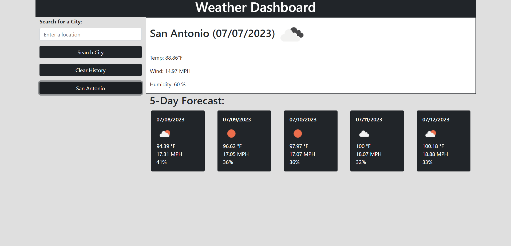

# Weather-or-Not

## Description

Here we have a weather dashboard. It will display the current weather as well as the 5 day future forecast. There is a city search button as well as a clear history button. The main part of the screen will show the current weather conditions and below that, the 5 day weather. This application was created using HTML and JavaScript. There is little to no CSS in this as it was styled using Bootstrap.

Here is a link to the deployed site on GitHub:

https://robertc91.github.io/Weather-or-Not/

As well as an image showcasing the Start Screen of the page:

## Installation

There are no installation requirements for this application.

## Usage

You can use this application to check the weather in any city, simply input the name of the city you wish to check in the Search Bar and click Search City. The application will then automatically display the current weather as well as the 5 day forecast.

## License

MIT License